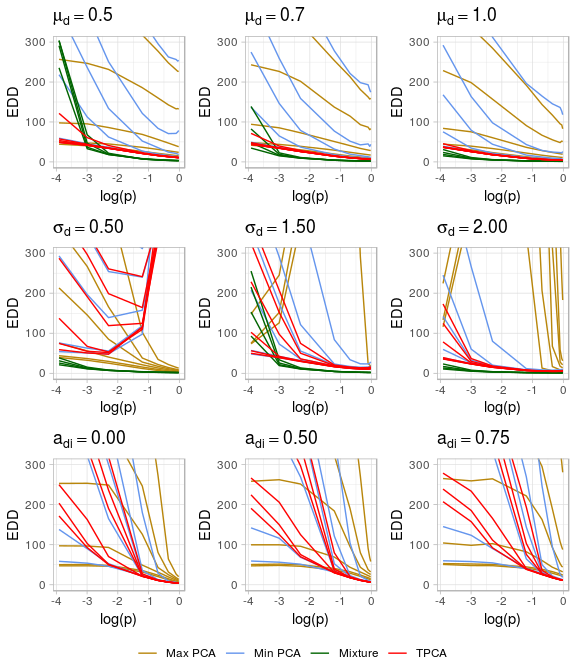
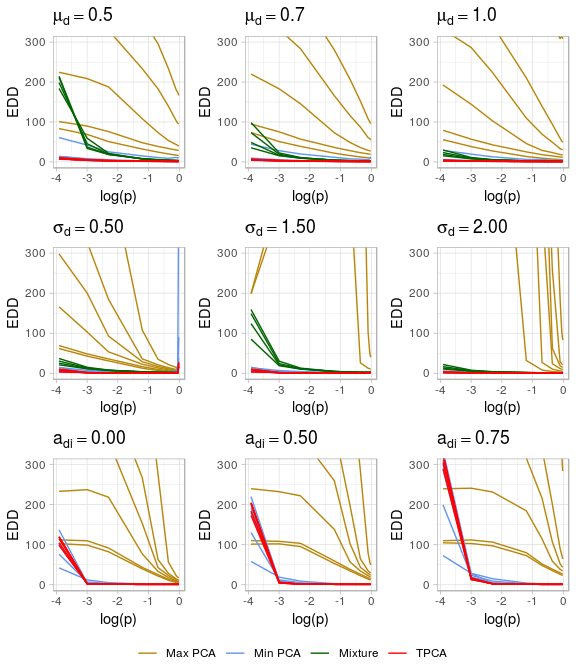
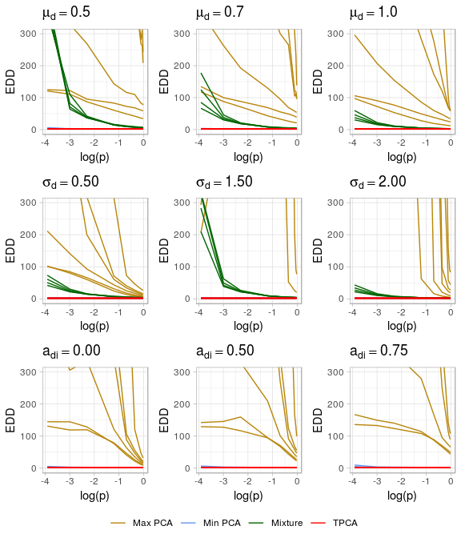
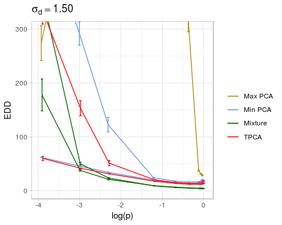

<!-- README.md is generated from README.Rmd. Please edit that file -->
tpcaMonitoring
==============

An `R` package containing all code to reproduce the results in the paper "Online Detection of Sparse Changes in High-Dimensional Data Streams Using Tailored Projections". In addition, the package contains the files with the results we obtained by running the simulation study. It is also an aim that this package can be used by others who want to test TPCA for their monitoring tasks, both for bootstrapping thresholds and testing performance in terms of expected detection delays (EDD).

Overview
--------

Functionality:

-   Functions for finding thresholds by bootstrping (parametric and non-parametric).
-   Functions for simulating run lengths to estimate EDD.
-   Functions to generate and retrieve the test data used in the simulation study.
-   The monitoring functions (the running detection statistics) are implemented by Rcpp.
-   Summary and plot functions.

Installation
------------

You can install tpcaMonitoring from github with:

``` r
# install.packages("devtools")
devtools::install_github("Tveten/tpcaMonitoring")
```

Exported and documented functions
---------------------------------

For more information, see the documentation of the functions below inside R. \* est\_edd\_all\_methods \* gen\_train \* get\_training\_sets \* ggplot\_edd\_conf\_int \* mixture\_arl \* multiplot\_edd\_summary \* run\_simstudy \* threshold\_finder \* tpca\_arl

Example
-------

``` r
library(tpcaMonitoring)
# To run the entire simulation study, use run_simstudy().
# It will take several days to run, but the output from it is also contained in
# this package so that one can still get plots of results and study the results in more detail.
# The code in run_simstudy() specifies in a simple way the simulation
# setup and the necessary steps in the study.

# Generate the test sets used:
n_sets <- 30
d <- 100
m <- 2 * d
training_sets <- get_training_sets(n_sets, d = d, m = m)
```

``` r
# Plot of the results for low correlation matrices:
multiplot_edd_summary(cov_mat_type = 'low')
```



``` r

# Plot of the results for low correlation matrices:
multiplot_edd_summary(cov_mat_type = 'high')
```



``` r

# Plot of the EDD results for a single covariance matrix/training set:
multiplot_edd_summary(cov_mat_nr = 5)
```



``` r
# Plot EDD results with confidence intervals:
ggplot_edd_conf_int(n = 100, alpha = 0.01, m = 200, d = 100,
                    change_type = 'sd', change_param = 1.5)
#> Warning: position_dodge requires non-overlapping x intervals

#> Warning: position_dodge requires non-overlapping x intervals
```


